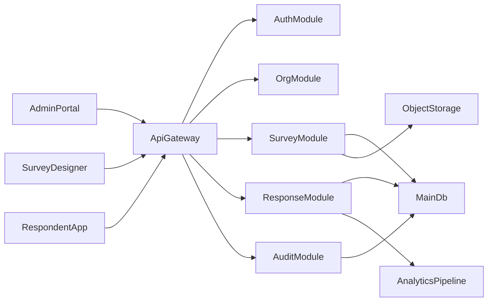

# 问易答新系统重建计划

## 目标与前提

这次重建按“企业版优先、绿地重建、技术栈重新选型”来规划。

现有仓库里有两类信息需要分开看：

- “当前真实可运行能力”应以 [C:\Users\Administrator.DESKTOP-854VSP0\Desktop\样本服务网站\问易答-调查系统\docs\项目功能清单与风险分析.md](C:\Users\Administrator.DESKTOP-854VSP0\Desktop\样本服务网站\问易答-调查系统\docs\项目功能清单与风险分析.md) 为锚点。
- “历史目标架构/企业化叙事”可参考 [C:\Users\Administrator.DESKTOP-854VSP0\Desktop\样本服务网站\问易答-调查系统\docs\企业部署与功能规范.md](C:\Users\Administrator.DESKTOP-854VSP0\Desktop\样本服务网站\问易答-调查系统\docs\企业部署与功能规范.md) 与 [C:\Users\Administrator.DESKTOP-854VSP0\Desktop\样本服务网站\问易答-调查系统\docs\产品亮点与差异化.md](C:\Users\Administrator.DESKTOP-854VSP0\Desktop\样本服务网站\问易答-调查系统\docs\产品亮点与差异化.md)。
- “现有编辑器与题型包袱”重点参考 [C:\Users\Administrator.DESKTOP-854VSP0\Desktop\样本服务网站\问易答-调查系统\docs\题型规范.md](C:\Users\Administrator.DESKTOP-854VSP0\Desktop\样本服务网站\问易答-调查系统\docs\题型规范.md) 与 [C:\Users\Administrator.DESKTOP-854VSP0\Desktop\样本服务网站\问易答-调查系统\docs\前端编辑器解耦重构步骤.md](C:\Users\Administrator.DESKTOP-854VSP0\Desktop\样本服务网站\问易答-调查系统\docs\前端编辑器解耦重构步骤.md)。

## 现状提炼

可以继承的核心价值：

- 问卷主链路已验证：登录、创建、编辑、发布、填写、结果查看。
- 已有企业化雏形：用户、角色、部门、基础权限、文件上传、后台工作台。
- 编辑器与题型体系较丰富，说明业务模型已有积累。

需要主动丢弃的包袱：

- 历史文档与当前实现分叉严重，尤其是 Mongo/ClickHouse 与 MySQL 两套叙事并存。
- 编辑器存在 legacy 题型映射，前后端语义未完全统一。
- “部门”正在代偿“团队协作”职责，说明领域模型还不够清晰。
- 占位模块较多，不能作为新系统设计依据。

## 新系统建议边界

新系统建议拆成 3 个层次，不一次把所有能力塞进 MVP：

1. 核心问卷平台

- 企业、组织、成员、角色权限
- 问卷模板、问卷创建、发布、收集、结果、导出
- 题型系统、逻辑规则、回收设置

1. 企业协作层

- 团队空间
- 邀请加入、审批、资源共享
- 操作审计、导出审批、消息通知

1. 平台与集成层

- 租户隔离
- SSO/LDAP/企业微信等登录集成
- 存储、报表、Webhook/OpenAPI
- 部署、监控、备份、审计合规

## 推荐重建设计

### 1. 先做领域重建，再定技术栈

先输出一版企业版领域模型，明确哪些概念是独立实体，避免继续用旧系统中的“部门代偿团队”。

建议优先固化这些核心领域：

- Tenant / Enterprise
- Workspace / Team
- User / Membership / Role
- Survey / SurveyVersion / Template
- Question / QuestionSchema / LogicRule
- Response / ResponseItem
- Asset / File
- AuditLog / Approval / Notification

### 2. 统一问卷 DSL

题型、逻辑、显示条件、跳题规则，不应再依赖前端 legacy 数字编码。新系统建议建立一套统一的问卷 Schema DSL：

- 题型统一使用字符串标识
- 前后端共用 Schema 定义与校验规则
- 编辑器保存的是 Schema，不是 UI 临时结构
- 填写端、统计端、导入导出都围绕同一份 Schema 演进

### 3. 企业版架构建议

建议采用“单体优先、模块清晰、为将来拆分留边界”的路线，而不是一开始上微服务。

建议方向：

- 前端：管理后台 + 问卷设计器 + 填写端分域组织，可同仓库 monorepo。
- 后端：模块化单体，按身份与业务域拆分模块。
- 数据库：主业务库采用关系型数据库；分析能力先做在线聚合与预计算，确认数据量后再决定是否引入分析库。
- 文件与静态资源：对象存储抽象层。
- 权限：RBAC 起步，预留 ABAC 扩展点。

## 建议实施阶段

### 阶段 A：产品与领域定稿

- 盘点旧系统所有“真实已闭环能力”和“只是规划/占位能力”。
- 输出新系统功能地图，明确企业版首发范围。
- 产出领域模型、角色模型、权限矩阵、核心业务流程图。

### 阶段 B：技术选型与基础架构

- 选定前端、后端、数据库、部署模型。
- 设计 monorepo、代码规范、模块边界、接口协议、错误模型。
- 确定认证方式、租户隔离方案、文件存储方案、审计方案。

### 阶段 C：核心数据与问卷 Schema

- 先定义 Survey Schema、Question Schema、LogicRule Schema。
- 再定义组织、成员、角色、协作、审计等表结构或聚合结构。
- 明确版本化策略：问卷发布后如何冻结版本、答卷如何绑定版本。

### 阶段 D：首发能力建设

- 企业登录与成员体系
- 工作台与空间管理
- 问卷设计器最小闭环
- 发布与填写闭环
- 结果查看与基础导出
- 审计日志与权限校验

### 阶段 E：企业增强能力

- 模板中心与题库中心
- 邀请、审批、消息通知
- 更细颗粒度的数据权限
- SSO/目录同步
- 高级分析与报表

### 阶段 F：迁移与替换策略

- 确定旧系统哪些数据要迁移，哪些只保留归档。
- 为问卷、答卷、用户、文件制定迁移映射规则。
- 制定灰度上线方案：并行期、只读期、切换点、回滚策略。

## 我建议我们先讨论的重点

为了让后续实施 plan 更实，我建议下一轮讨论优先收敛这 4 件事：

- 新系统首发版本到底做到“企业基础版”还是“企业完整版”。
- 前端是继续 Vue 生态还是切到 React 生态。
- 后端是模块化 Node 框架还是换到其他后端语言体系。
- 数据分析先内置在主库方案里，还是从第一天就设计独立分析链路。

## 当前结论

这个项目值得继承的是“业务闭环”和“问卷产品经验”，不值得继承的是“历史架构摇摆”和“实现层兼容包袱”。

如果按企业版新系统来做，正确顺序应该是：先重新定义产品边界与领域模型，再做技术选型，再开始编码，而不是直接从旧仓库里裁剪代码。