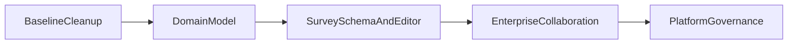

# 问易答旧系统渐进改造计划

## 改造目标

不推翻现有系统，保留已经跑通的业务主链路，在旧仓库基础上完成企业化收口。

这条路线的核心思路是：

- 保留当前已验证的闭环能力：登录、问卷创建、编辑、发布、填写、结果查看。
- 不再把历史文档中的旧架构当成目标，而是以当前源码现状为准。
- 优先解决真正会阻碍企业化演进的问题，而不是先做大范围技术换栈。

当前最可靠的现状锚点：

- [C:\Users\Administrator.DESKTOP-854VSP0\Desktop\样本服务网站\问易答-调查系统\docs\项目功能清单与风险分析.md](C:\Users\Administrator.DESKTOP-854VSP0\Desktop\样本服务网站\问易答-调查系统\docs\项目功能清单与风险分析.md)
- [C:\Users\Administrator.DESKTOP-854VSP0\Desktop\样本服务网站\问易答-调查系统\docs\题型规范.md](C:\Users\Administrator.DESKTOP-854VSP0\Desktop\样本服务网站\问易答-调查系统\docs\题型规范.md)
- [C:\Users\Administrator.DESKTOP-854VSP0\Desktop\样本服务网站\问易答-调查系统\docs\前端编辑器解耦重构步骤.md](C:\Users\Administrator.DESKTOP-854VSP0\Desktop\样本服务网站\问易答-调查系统\docs\前端编辑器解耦重构步骤.md)

## 为什么选“只改旧系统”

这条路线的优点：

- 交付更快，可以在已有功能上持续迭代。
- 风险更低，不需要先承担大规模迁移和重建的启动成本。
- 更适合先做企业版可售卖版本，再决定是否做第二代系统。

这条路线的代价：

- 会继续背一部分历史包袱。
- 架构上很难一步到位做到“完全整洁”。
- 必须严格控制改造顺序，否则容易边改边乱。

## 改造原则

1. 先收口领域模型，再补功能，不先追求大规模重写。
2. 先动高收益、低爆炸半径的模块。
3. 任何改造都要保证问卷主链路不中断。
4. 前后端统一语义，逐步删除兼容映射和占位实现。
5. 企业能力优先于表面页面数量。

## 建议优先级

### 第一阶段：统一“当前系统到底是什么”

目标：把文档、接口、前端模型、数据库语义统一到同一套说法上。

重点工作：

- 明确当前唯一权威技术路线，停止混用历史 Mongo/ClickHouse 叙事。
- 统一核心命名：如问卷、答卷、分享码、提交数、状态字段。
- 整理一份当前真实模块地图，标记“已闭环 / 半成品 / 占位模块”。
- 为后续改造建立基线文档，避免继续按旧认知开发。

### 第二阶段：收口企业领域模型

目标：把“企业化”真正落到数据模型和权限模型，而不是散落在页面上。

重点工作：

- 明确 `企业/租户`、`部门`、`团队/协作组`、`成员`、`角色` 的边界。
- 决定是否引入独立 `Team` 模型，不再由 `Dept` 代偿协作能力。
- 梳理权限模型：系统管理员、企业管理员、部门管理员、问卷编辑者、分析者等。
- 为重要操作补审计边界：创建、发布、导出、删除、成员变更。

### 第三阶段：问卷模型与编辑器治理

目标：把最复杂、最容易继续失控的编辑器和题型体系稳定下来。

重点工作：

- 以字符串题型作为唯一权威模型，逐步淘汰前端 legacy 数字映射。
- 对齐编辑器配置能力与后端真实持久化/校验能力，停止“前端能配、后端不执行”的状态。
- 把题型、逻辑、显示条件、跳题规则沉淀成统一 Schema。
- 延续 [C:\Users\Administrator.DESKTOP-854VSP0\Desktop\样本服务网站\问易答-调查系统\docs\前端编辑器解耦重构步骤.md](C:\Users\Administrator.DESKTOP-854VSP0\Desktop\样本服务网站\问易答-调查系统\docs\前端编辑器解耦重构步骤.md) 的思路，继续拆编辑器巨型页面。

### 第四阶段：企业协作能力补齐

目标：把“企业版”真正补成可卖的产品能力。

重点工作：

- 成员导入、组织管理、角色管理继续做实。
- 实现团队邀请、加入流程、协作边界。
- 收口占位模块中最关键的几个：`folders`、`messages`、`audits`。
- 补模板中心、题库中心、组织内共享与复用能力。

### 第五阶段：平台治理与性能

目标：让系统更适合长期维护和企业部署。

重点工作：

- 完善数据库迁移机制，避免只靠初始化脚本演进。
- 补关键后端测试，至少覆盖认证、组织、问卷发布、提交、导出等主流程。
- 处理前端构建体积和页面性能问题。
- 完善监控、日志、错误处理、部署文档。

## 推荐实施顺序

## 第一批最值得做的 6 件事

1. 统一一份“当前权威文档”，明确系统以现有实现为准。
2. 定义 `Team` 是否独立建模，并梳理 `Dept` 与 `Team` 的职责边界。
3. 统一题型模型，制定 legacy 映射清理计划。
4. 继续拆分编辑器核心页面，隔离类型、映射、状态与子组件。
5. 为 `users/import`、部门删除、问卷发布/填写等高风险流程补测试。
6. 明确并清理占位模块，决定哪些要落地、哪些先下线隐藏。

## 这条路线的预期结果

如果按这个计划推进，旧系统可以逐步演化成“可持续交付的企业版 1.x”：

- 业务上不需要推倒重来。
- 架构上虽然不是完全绿地，但能明显降低后续失控风险。
- 等企业版能力稳定后，再决定是否进入真正的 2.0 重建阶段。

## 建议我们下一轮讨论的内容

下一轮最值得继续往下细化的是这三块：

- `Team`、`Dept`、`Role` 的企业协作模型怎么定。
- 问卷 Schema 和题型体系怎么统一。
- 旧系统改造的第一期范围要不要压缩到“企业最小可售版本”。

