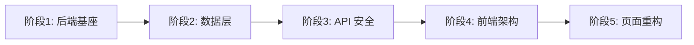

# 问易答调查系统 - 全面重构计划

## 现状诊断

经过全面分析，当前项目存在以下严重问题：

### 致命问题 (P0)

- **安全漏洞**：大量 API 无鉴权、明文密码、弱 JWT、无上传校验、SQL 拼接注入风险
- **双入口混乱**：`app.cjs`（MongoDB 完整版）与 `simple-server.js`（1550 行内存模拟版）并存，逻辑不一致
- **ESM/CJS 混用**：`package.json` 声明 `"type": "module"` 但大量文件使用 `.cjs`，加载混乱

### 严重问题 (P1)

- **API 层重复**：前端同时存在 `api/` 和 `services/` 两套请求层，部分用 `axios`（http 实例）、部分用原生 `fetch`（无 token）
- **数据模型不一致**：后端 Mongoose Schema 与 simple-server 内存结构字段名不同（`creatorId` vs `createdBy`、`projectId` vs `surveyId`）
- **类型系统形同虚设**：40+ 处 `any`，API 返回无类型，题目 id 在 `number`/`string` 间混用
- **Response 模型逻辑错误**：完成率硬编码 `/10`，统计百分比恒为 100%

### 中等问题 (P2)

- **巨型单文件**：`CreateSurveyPage.vue` 5700+ 行，`simple-server.js` 1550+ 行
- **状态管理分散**：认证信息靠 `localStorage` 散落各处，未集中到 Pinia
- **路由安全形同虚设**：`localStorage.getItem('role')` 可被伪造
- **桌面/移动问卷填写页逻辑大量重复**

---

## 重构策略

采用**渐进式重构**，分 5 个阶段，每阶段可独立上线。优先解决安全和数据层问题，再逐步优化前端。




---

## 阶段 1：后端基座重建

**目标**：消除双入口混乱，建立统一的后端架构。

### 1.1 统一入口与模块系统

- **删除 `simple-server.js`**，仅保留一套后端入口
- **统一为 ESM**：将 `app.cjs`、`auth.cjs`、`surveys.cjs` 全部改为 `.js`（ESM），消除 CJS/ESM 混用
- 重构入口文件 `app.js`，拆分为：
  - `app.js` - Express 实例创建与中间件注册
  - `server.js` - 启动与优雅关闭
  - `config/index.js` - 统一配置管理

### 1.2 安全中间件启用

- 取消注释并配置 `helmet`、`express-rate-limit`
- 配置 `cors` 白名单（仅允许前端域名）
- 添加请求体大小限制
- 添加 `multer` 文件类型和大小校验

### 1.3 统一错误处理

- 创建 `middlewares/errorHandler.js`，统一捕获和格式化错误
- 定义标准响应格式：`{ success: boolean, data?: any, error?: { code: string, message: string } }`
- 不再向客户端泄露内部错误信息

---

## 阶段 2：数据库迁移（MongoDB -> MySQL）

**目标**：用 MySQL 替换 MongoDB + ClickHouse，从 19 个模型精简到 6 张核心表。

### 2.1 为什么换 MySQL

- **部署友好**：企业客户（尤其政企）几乎都有 MySQL，运维团队熟悉，Linux/Windows 通吃
- **数据结构天然适合关系型**：用户-问卷-答卷-部门-角色都是标准关系数据
- **去掉 ClickHouse**：中等规模统计 MySQL 完全胜任，减少部署复杂度

### 2.2 删除的内容

- **删除全部 19 个 Mongoose 模型文件**（`backend/src/models/*.js`）
- **删除 `backend/src/database/` 目录**（MongoDBAdapter、BaseAdapter）
- **删除 `backend/src/utils/clickhouse.js`** 和 `answersReplicator` 相关代码
- **移除依赖**：`mongoose`、ClickHouse HTTP 客户端代码
- 不再需要 MongoDB 连接配置

### 2.3 新增 MySQL 表结构（6 张表）

使用 **Knex.js**（轻量 SQL 查询构建器 + Migration 管理），不用重型 ORM。

```sql
-- users 表
CREATE TABLE users (
  id          INT UNSIGNED AUTO_INCREMENT PRIMARY KEY,
  username    VARCHAR(50)  NOT NULL UNIQUE,
  password    VARCHAR(255) NOT NULL,
  email       VARCHAR(255) DEFAULT NULL,
  role_id     INT UNSIGNED DEFAULT NULL,
  dept_id     INT UNSIGNED DEFAULT NULL,
  avatar      VARCHAR(500) DEFAULT NULL,
  is_active   TINYINT(1)   DEFAULT 1,
  last_login_at DATETIME   DEFAULT NULL,
  created_at  DATETIME     DEFAULT CURRENT_TIMESTAMP,
  updated_at  DATETIME     DEFAULT CURRENT_TIMESTAMP ON UPDATE CURRENT_TIMESTAMP,
  INDEX idx_role (role_id),
  INDEX idx_dept (dept_id)
);

-- roles 表
CREATE TABLE roles (
  id          INT UNSIGNED AUTO_INCREMENT PRIMARY KEY,
  name        VARCHAR(50)  NOT NULL,
  code        VARCHAR(50)  NOT NULL UNIQUE,
  permissions JSON         DEFAULT NULL,  -- ["survey:create","survey:delete","user:manage",...]
  remark      VARCHAR(255) DEFAULT NULL,
  created_at  DATETIME     DEFAULT CURRENT_TIMESTAMP
);

-- depts 表
CREATE TABLE depts (
  id          INT UNSIGNED AUTO_INCREMENT PRIMARY KEY,
  name        VARCHAR(100) NOT NULL,
  parent_id   INT UNSIGNED DEFAULT NULL,
  sort_order  INT          DEFAULT 0,
  created_at  DATETIME     DEFAULT CURRENT_TIMESTAMP,
  INDEX idx_parent (parent_id)
);

-- surveys 表（questions 用 JSON 列内嵌）
CREATE TABLE surveys (
  id          INT UNSIGNED AUTO_INCREMENT PRIMARY KEY,
  title       VARCHAR(200) NOT NULL,
  description TEXT         DEFAULT NULL,
  creator_id  INT UNSIGNED NOT NULL,
  questions   JSON         NOT NULL,       -- 题目数组，内嵌存储
  settings    JSON         DEFAULT NULL,   -- 问卷配置（截止时间、限制等）
  style       JSON         DEFAULT NULL,   -- 样式/主题配置
  share_code  VARCHAR(20)  DEFAULT NULL UNIQUE,
  status      ENUM('draft','published','closed') DEFAULT 'draft',
  response_count INT       DEFAULT 0,
  created_at  DATETIME     DEFAULT CURRENT_TIMESTAMP,
  updated_at  DATETIME     DEFAULT CURRENT_TIMESTAMP ON UPDATE CURRENT_TIMESTAMP,
  INDEX idx_creator (creator_id),
  INDEX idx_status (status)
);

-- answers 表（答卷数据用 JSON 列）
CREATE TABLE answers (
  id          INT UNSIGNED AUTO_INCREMENT PRIMARY KEY,
  survey_id   INT UNSIGNED NOT NULL,
  answers_data JSON        NOT NULL,       -- [{questionId, value, ...}, ...]
  ip_address  VARCHAR(45)  DEFAULT NULL,
  user_agent  VARCHAR(500) DEFAULT NULL,
  duration    INT          DEFAULT NULL,   -- 填写耗时（秒）
  status      ENUM('completed','incomplete') DEFAULT 'completed',
  submitted_at DATETIME    DEFAULT CURRENT_TIMESTAMP,
  INDEX idx_survey (survey_id),
  INDEX idx_submitted (submitted_at)
);

-- files 表
CREATE TABLE files (
  id          INT UNSIGNED AUTO_INCREMENT PRIMARY KEY,
  name        VARCHAR(255) NOT NULL,
  url         VARCHAR(500) NOT NULL,
  size        INT UNSIGNED DEFAULT 0,
  type        VARCHAR(50)  DEFAULT NULL,
  uploader_id INT UNSIGNED DEFAULT NULL,
  created_at  DATETIME     DEFAULT CURRENT_TIMESTAMP,
  INDEX idx_uploader (uploader_id)
);
```

### 2.4 数据访问层设计

新建 `backend/src/db/` 目录：

```
backend/src/db/
  knex.js          - Knex 实例初始化（读取 .env 中的 MySQL 配置）
  migrations/      - Knex migration 文件（建表、改表）
  seeds/           - 初始数据（默认管理员、默认角色）
```

新建 `backend/src/models/` 目录（纯 JS 数据访问层，不再是 Mongoose Schema）：

```
backend/src/models/
  User.js          - findById, findByUsername, create, update, verifyPassword
  Survey.js        - CRUD + 按 shareCode 查询 + 统计
  Answer.js        - 提交、按 surveyId 分页查询、导出
  Role.js          - CRUD
  Dept.js          - 树形 CRUD
  File.js          - CRUD
```

每个 Model 内部调用 `knex` 实例，对外暴露业务方法，控制器不直接写 SQL。

### 2.5 环境变量更新

`.env` 从 MongoDB 配置改为 MySQL 配置：

```
DB_HOST=localhost
DB_PORT=3306
DB_USER=root
DB_PASSWORD=
DB_NAME=survey_system
```

去掉 `MONGODB_URI`、`CLICKHOUSE_*` 等变量。

---

## 阶段 3：API 路由与鉴权

**目标**：所有接口加上鉴权，统一路由设计。

### 3.1 鉴权中间件重构

重构 `middlewares/auth.js`：

- JWT 密钥必须从环境变量读取，启动时校验
- Token 验证后查库确认用户状态（未禁用）
- 区分错误类型：未登录(401)、Token 过期(401 + code)、权限不足(403)
- 登录/注册接口添加 rate-limit

### 3.2 统一路由结构

```
routes/
  auth.js        - 登录/注册/me
  surveys.js     - 问卷 CRUD + 统计
  answers.js     - 答卷提交/查询/导出（合并 answer + response）
  users.js       - 用户管理（管理员）
  files.js       - 文件上传/管理
  depts.js       - 部门管理
  roles.js       - 角色管理
```

- 消除 `/api/surveys` 与 `/api/project` 的概念混乱，统一为 `/api/surveys`
- 所有管理接口加 `authRequired` + `requireRole('admin')`
- 公开接口（如答卷填写）加频率限制

### 3.3 控制器重构

- 所有控制器添加请求体白名单校验（引入 `express-validator` 或 `joi`）
- 禁止 `Model.create(req.body)` 直接写入
- 文件删除时同步清理物理文件

---

## 阶段 4：前端架构整理

**目标**：消除 API/Service 双层混乱，建立统一状态管理。

### 4.1 API 层统一

- **删除所有 `services/*.ts` 中使用 `fetch` 的文件**（`userService`、`deptService`、`fileService`、`projectService`、`surveyAnswerService`、`answerService`、`questionService`）
- **统一使用 `api/http.ts` 的 axios 实例**，确保所有请求自动携带 token
- 合并重复 API 文件：`users.ts` + `userAdmin.ts` -> `users.ts`
- `projectService` 路径从 `/api/project` 改为 `/api/surveys`

最终 API 目录结构：

```
api/
  http.ts          - axios 实例 + 拦截器
  auth.ts          - 登录/注册
  surveys.ts       - 问卷
  answers.ts       - 答卷（合并 surveyAnswers + answerService）
  users.ts         - 用户
  files.ts         - 文件
  depts.ts         - 部门
  roles.ts         - 角色
```

### 4.2 http.ts 拦截器增强

- 请求拦截：自动从 Pinia store 取 token，附加 Authorization
- 响应拦截：401 -> 清除登录态 + 跳转登录页；统一错误提示

### 4.3 Pinia 状态管理

创建核心 Store：

- `stores/auth.ts` - token、用户信息、角色、登录/登出
- `stores/survey.ts` - 当前编辑的问卷状态

替代现有的 `localStorage` 散落用法和 `composables/useAuth.ts`。

### 4.4 类型系统完善

在 `types/` 中补充完整类型定义：

- `types/api.ts` - 统一 API 响应泛型 `ApiResponse<T>`
- `types/survey.ts` - 重写，题目 id 统一为 `string`，选项有完整类型
- `types/user.ts` - 用户、角色相关类型
- `types/answer.ts` - 答卷相关类型

在 `router/index.ts` 中扩展 `RouteMeta` 类型，消除 `as any`。

---

## 阶段 5：页面组件重构

**目标**：拆分巨型组件，消除重复代码，提升可维护性。

### 5.1 CreateSurveyPage 拆分

将 5700 行的 `CreateSurveyPage.vue` 拆分为：

```
views/survey/create/
  CreateSurveyPage.vue        - 主容器（路由/布局）
  components/
    SurveyHeader.vue           - 标题/描述编辑
    QuestionList.vue            - 题目列表（拖拽排序）
    QuestionEditor.vue          - 单题编辑器
    QuestionTypeSelector.vue    - 题型选择
    OptionEditor.vue            - 选项编辑
    SurveySettings.vue          - 问卷设置
    SurveyPreview.vue           - 预览面板
  composables/
    useSurveyEditor.ts          - 问卷编辑核心逻辑
    useQuestionDrag.ts           - 拖拽排序
```

### 5.2 问卷填写页合并

- 提取 `composables/useSurveyFill.ts`，包含题目渲染、校验、提交等共享逻辑
- `FillSurveyPage.vue` 和 `FillSurveyMobilePage.vue` 共享此 composable，仅保留布局差异

### 5.3 登录页修复

- 使用 `api/http.ts` 实例替代直接 `axios` 调用
- 验证码校验逻辑补全
- 角色以后端返回为准，前端不传 role

### 5.4 路由守卫增强

- 从 Pinia auth store 取用户信息，不再依赖 `localStorage`
- Token 过期时自动清除并跳转
- 管理员路由守卫使用服务端验证的角色

### 5.5 依赖清理

- 移除 `quill`，统一使用 `@wangeditor`（或反之）
- 升级过时依赖版本
- 配置 Vite chunk 拆分优化

---

## 文件变动预估

- 后端入口/配置：新增 ~3，修改 ~2，删除 ~2（simple-server.js、重复路由文件）
- 后端数据库层：新增 ~10（knex 配置、migration、6 个 Model），删除 ~22（19 个 Mongoose 模型 + database 适配器目录 + clickhouse 工具）
- 后端路由/控制器：新增 ~2，修改 ~8，删除 ~3（重复路由文件）
- 后端中间件/工具：新增 ~2，修改 ~3，删除 ~2（clickhouse.js、answersReplicator）
- 后端依赖变化：移除 mongoose，新增 knex + mysql2
- 前端 API：修改 ~8，删除 ~7（services 重复文件）
- 前端状态/类型：新增 ~4，修改 ~5，删除 ~2
- 前端页面：新增 ~10（拆分组件），修改 ~8

---

## 执行顺序建议

按阶段顺序执行，每阶段完成后可独立测试。建议优先完成阶段 1-2（后端基座 + MySQL 迁移），因为这是最大的变化。然后阶段 3（安全），最后阶段 4-5（前端），因为前端依赖后端 API 的稳定。

部署依赖变化：客户环境只需 Node.js + MySQL，不再需要 MongoDB 和 ClickHouse。