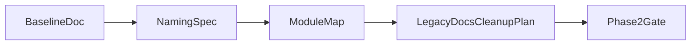

# 问易答第一阶段详细计划

## 阶段目标

本阶段只做一件事：统一“当前系统到底是什么”。

不是先改功能，也不是先重写架构，而是先把以下 4 件事变成全团队唯一真相：

- 当前真实技术路线是什么。
- 核心接口和字段到底该怎么叫。
- 现有哪些模块已经闭环，哪些还是半成品或占位。
- 后续所有改造应以哪份基线文档和哪些源码文件为准。

## 当前结论

根据现有仓库的只读梳理，当前运行主线应以源码为准：

- 后端主入口是 [C:\Users\Administrator.DESKTOP-854VSP0\Desktop\样本服务网站\问易答-调查系统\backend\server.js](C:\Users\Administrator.DESKTOP-854VSP0\Desktop\样本服务网站\问易答-调查系统\backend\server.js)
- Express 应用装配在 [C:\Users\Administrator.DESKTOP-854VSP0\Desktop\样本服务网站\问易答-调查系统\backend\app.js](C:\Users\Administrator.DESKTOP-854VSP0\Desktop\样本服务网站\问易答-调查系统\backend\app.js)
- 数据访问主线是 [C:\Users\Administrator.DESKTOP-854VSP0\Desktop\样本服务网站\问易答-调查系统\backend\src\db\knex.js](C:\Users\Administrator.DESKTOP-854VSP0\Desktop\样本服务网站\问易答-调查系统\backend\src\db\knex.js) 与 [C:\Users\Administrator.DESKTOP-854VSP0\Desktop\样本服务网站\问易答-调查系统\backend\src\db\migrate.js](C:\Users\Administrator.DESKTOP-854VSP0\Desktop\样本服务网站\问易答-调查系统\backend\src\db\migrate.js)
- 当前可信的现状说明文档是 [C:\Users\Administrator.DESKTOP-854VSP0\Desktop\样本服务网站\问易答-调查系统\docs\项目功能清单与风险分析.md](C:\Users\Administrator.DESKTOP-854VSP0\Desktop\样本服务网站\问易答-调查系统\docs\项目功能清单与风险分析.md)

而以下文档大概率会持续误导后续开发，必须在本阶段被处理：

- [C:\Users\Administrator.DESKTOP-854VSP0\Desktop\样本服务网站\问易答-调查系统\docs\环境安装指南.md](C:\Users\Administrator.DESKTOP-854VSP0\Desktop\样本服务网站\问易答-调查系统\docs\环境安装指南.md)
- [C:\Users\Administrator.DESKTOP-854VSP0\Desktop\样本服务网站\问易答-调查系统\docs\开发指南.md](C:\Users\Administrator.DESKTOP-854VSP0\Desktop\样本服务网站\问易答-调查系统\docs\开发指南.md)
- [C:\Users\Administrator.DESKTOP-854VSP0\Desktop\样本服务网站\问易答-调查系统\docs\企业部署与功能规范.md](C:\Users\Administrator.DESKTOP-854VSP0\Desktop\样本服务网站\问易答-调查系统\docs\企业部署与功能规范.md)
- [C:\Users\Administrator.DESKTOP-854VSP0\Desktop\样本服务网站\问易答-调查系统\docs\API接口说明.md](C:\Users\Administrator.DESKTOP-854VSP0\Desktop\样本服务网站\问易答-调查系统\docs\API接口说明.md)
- [C:\Users\Administrator.DESKTOP-854VSP0\Desktop\样本服务网站\问易答-调查系统\docs\题型规范.md](C:\Users\Administrator.DESKTOP-854VSP0\Desktop\样本服务网站\问易答-调查系统\docs\题型规范.md)
- [C:\Users\Administrator.DESKTOP-854VSP0\Desktop\样本服务网站\问易答-调查系统\docs\产品亮点与差异化.md](C:\Users\Administrator.DESKTOP-854VSP0\Desktop\样本服务网站\问易答-调查系统\docs\产品亮点与差异化.md)
- [C:\Users\Administrator.DESKTOP-854VSP0\Desktop\样本服务网站\问易答-调查系统\backend\README.md](C:\Users\Administrator.DESKTOP-854VSP0\Desktop\样本服务网站\问易答-调查系统\backend\README.md)
- [C:\Users\Administrator.DESKTOP-854VSP0\Desktop\样本服务网站\问易答-调查系统\目录速览.md](C:\Users\Administrator.DESKTOP-854VSP0\Desktop\样本服务网站\问易答-调查系统\目录速览.md)

## 本阶段产出物

本阶段结束后，必须有这 5 份产出：

1. 一份“当前系统基线说明”主文档

- 用来定义当前唯一权威技术路线、运行入口、数据层、模块现状。
- 后续所有文档都要引用它，而不是各说各话。

1. 一份“术语与字段命名规范”文档

- 统一问卷、答卷、分享码、提交数、状态、时间字段的标准叫法。
- 明确哪些字段名是主字段，哪些只是兼容别名。

1. 一份“真实模块地图”文档

- 按模块标记 `已闭环 / 半成品 / 占位`。
- 标明每个判断对应的主要源码位置。

1. 一份“历史文档处理清单”

- 明确哪些文档重写、哪些只加顶部警告、哪些归档。
- 避免老文档继续误导。

1. 一份“第一阶段变更边界说明”

- 明确本阶段只统一认知与命名，不主动做功能重构。
- 防止阶段范围失控。

## 工作流拆解

### 工作流 A：确立权威基线

目标：明确“以后看哪里算准”。

要做的事：

- 以 [docs/项目功能清单与风险分析.md](C:\Users\Administrator.DESKTOP-854VSP0\Desktop\样本服务网站\问易答-调查系统\docs\项目功能清单与风险分析.md) 为产品现状主文档。
- 以 `backend/server.js`、`backend/app.js`、`backend/src/db/knex.js`、`backend/src/db/migrate.js` 为运行与数据层真相。
- 明确当前技术路线一句话版本：`Vue 3 + TypeScript + Vite` 前端，`Express + Knex + MySQL` 后端。
- 在所有历史文档顶部补“状态标签”：`当前有效`、`历史方案`、`待重写` 三类之一。

定义完成标准：

- 新成员只看一份主文档，就能知道项目怎么跑、后端入口是什么、数据库是什么、哪些文档不可信。

### 工作流 B：统一术语和字段语义

目标：停止一套业务出现多种说法。

建议优先统一的术语：

- `survey`：统一表示问卷主实体。
- `response` 与 `answer`：要明确一个是“提交动作/一次回收”，一个是“存储资源”，或直接选一个为主术语。
- `share_code`：统一公开访问标识，不再与 `shareId` 混用。
- `response_count`：统一表示问卷回收份数，不再并列使用 `answerCount`、`submitCount`、`responseCount`。
- `status`：区分问卷状态与答卷状态，避免同名不同义。
- 时间字段：决定 API 层是否统一 `snake_case` 或 `camelCase`，前端最多保留一层映射。

建议重点核对的文件：

- [C:\Users\Administrator.DESKTOP-854VSP0\Desktop\样本服务网站\问易答-调查系统\backend\src\routes\surveys.js](C:\Users\Administrator.DESKTOP-854VSP0\Desktop\样本服务网站\问易答-调查系统\backend\src\routes\surveys.js)
- [C:\Users\Administrator.DESKTOP-854VSP0\Desktop\样本服务网站\问易答-调查系统\backend\src\routes\answers.js](C:\Users\Administrator.DESKTOP-854VSP0\Desktop\样本服务网站\问易答-调查系统\backend\src\routes\answers.js)
- [C:\Users\Administrator.DESKTOP-854VSP0\Desktop\样本服务网站\问易答-调查系统\frontend\src\types\survey.ts](C:\Users\Administrator.DESKTOP-854VSP0\Desktop\样本服务网站\问易答-调查系统\frontend\src\types\survey.ts)
- [C:\Users\Administrator.DESKTOP-854VSP0\Desktop\样本服务网站\问易答-调查系统\frontend\src\types\answer.ts](C:\Users\Administrator.DESKTOP-854VSP0\Desktop\样本服务网站\问易答-调查系统\frontend\src\types\answer.ts)
- [C:\Users\Administrator.DESKTOP-854VSP0\Desktop\样本服务网站\问易答-调查系统\frontend\src\api\surveys.ts](C:\Users\Administrator.DESKTOP-854VSP0\Desktop\样本服务网站\问易答-调查系统\frontend\src\api\surveys.ts)
- [C:\Users\Administrator.DESKTOP-854VSP0\Desktop\样本服务网站\问易答-调查系统\frontend\src\views\UserDashboard.vue](C:\Users\Administrator.DESKTOP-854VSP0\Desktop\样本服务网站\问易答-调查系统\frontend\src\views\UserDashboard.vue)

定义完成标准：

- 形成一张术语对照表：标准名、旧别名、保留策略、影响文件。
- 后续改造先按这张表收敛，不再边写边发明新别名。

### 工作流 C：产出真实模块地图

目标：把“什么已经能卖、什么只是看起来有页面”说清楚。

建议模块分类：

- 已闭环：认证、问卷、填写端、文件、文件夹、消息、审计。
- 半成品：编辑器、答卷与导出、结果页/统计、用户/角色/部门、工作台、管理后台壳。
- 占位：岗位、题库、流程，以及部分后台总览和配置页。

建议落地方式：

- 每个模块记录 4 个字段：`模块名`、`状态`、`判断依据`、`主要文件`。
- 所有状态判断必须能指回源码或 API，不按页面长相判断。

定义完成标准：

- 任何人都能快速回答“这个模块是真实现还是占位”。
- 产品规划和开发排期不再把占位页面误算成已交付能力。

### 工作流 D：处理历史文档

目标：把最误导人的文档先止血。

建议优先级：

- P0 立即处理：`docs/环境安装指南.md`、`docs/开发指南.md`、`docs/API接口说明.md`、`backend/README.md`、`目录速览.md`
- P1 同步处理：`docs/企业部署与功能规范.md`、`docs/产品亮点与差异化.md`、`docs/题型规范.md`
- P2 归档处理：历史计划文档与旧说明文档

处理动作分 3 类：

- `加警告头`：短期先保留内容，但顶部明确“历史方案，勿作为当前实现依据”。
- `重写替换`：对安装、开发、接口说明等高频入口文档直接重写为当前基线。
- `归档下线`：对纯历史决策文档保留但移出主阅读路径。

定义完成标准：

- 新人按 README 或 docs 入口阅读时，不会再被带到 Mongo/ClickHouse 叙事里。

### 工作流 E：建立后续改造基线

目标：让第二阶段以后都有统一参照物。

需要在主基线文档中明确：

- 当前不再讨论旧双库方案，除非作为历史背景。
- 后续所有字段改名、接口收敛、模块补齐，都以第一阶段术语规范为依据。
- 第二阶段开始才能动领域模型与企业协作模型，不在本阶段混入业务重构。

定义完成标准：

- 第一阶段结束时，团队已经拥有一套清晰的“先说法统一，再动代码”的共识。

## 推荐执行顺序

1. 先建立“当前基线主文档”。
2. 再补“术语与字段规范”。
3. 然后输出“模块地图”。
4. 再处理误导性文档的状态标签和重写清单。
5. 最后把这四类成果汇总到 docs 的统一入口。

## 建议新增或重写的文档

建议第一阶段最终至少形成以下文档结构：

- `docs/当前系统基线.md`
- `docs/术语与字段命名规范.md`
- `docs/真实模块地图.md`
- `docs/历史文档处理清单.md`
- 更新 `docs/环境安装指南.md`
- 更新 `docs/API接口说明.md`
- 更新 `backend/README.md`

## 本阶段不做的事

为了避免阶段失控，以下内容不放进第一阶段：

- 不重构编辑器实现。
- 不改企业协作模型。
- 不大规模改 API 路径。
- 不直接做前后端字段重命名迁移。
- 不补新业务功能。

这些会在第一阶段形成基线后，再进入第二阶段与第三阶段。

## 风险与注意事项

- 当前文档与代码不一致的范围较大，不能“顺手修一点”，必须按优先级整体处理。
- 一些前端类型和页面里保留了兼容写法，第一阶段应先定义保留策略，不要急着删。
- 有些模块表面可用但底层仍不完整，模块地图必须按接口和数据闭环判断，不按 UI 完整度判断。

## 阶段验收标准

第一阶段完成后，至少满足以下条件：

- 团队内部对当前技术路线没有歧义。
- 核心术语和字段命名有统一标准。
- 所有主要模块都被标注为已闭环、半成品或占位。
- 高频入口文档不再误导读者进入历史方案。
- 第二阶段可以在统一基线之上继续做领域模型和企业能力改造。

